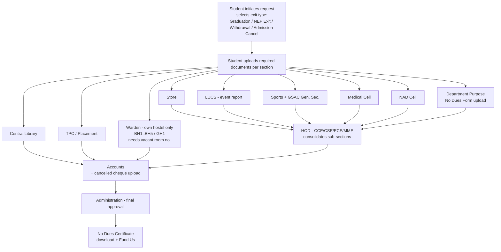

# LNMIIT No Dues Portal — Research & Design Document

*Research on existing college No Dues systems, findings from LNMIIT sections, and the proposed design and technology approach.*

**Project:** LNMIIT No Dues Portal
**Prepared for:** Faculty Mentor / Co-founder review
**Status:** Pre-development research phase
**Date:** July 2026

---

## 1. Executive Summary

Every graduating, withdrawing, or exiting student at LNMIIT must currently collect a paper "No Dues" clearance by physically visiting each section — library, hostel, stores, sports, medical, accounts, department, and administration — and getting a signature or stamp from each. The process is slow, hard to track, and produces no digital record.

This document does three things:

1. **Researches how peer institutions (IITs, NITs) run their No Dues process**, both online and on paper, and pulls out the patterns worth reusing — with authentic links to every source.
2. **Documents what each LNMIIT section actually does**, what it needs from a student, and what we learned after speaking with the people who run these sections.
3. **Proposes a design and technology approach** for a fully digital LNMIIT No Dues Portal, with reasoning for the key technical choices (Python/Django, OCR, file-size limits) placed only where a decision genuinely needs justification.

The core finding: most top Indian institutes have *partially* digitized this process, and even where portals exist they are behind logins and lightly documented. There is a real, concrete opportunity for LNMIIT to build a clean, fully digital, document-aware system — with OCR-assisted verification and per-section feedback — that goes beyond what is publicly visible elsewhere.

---

## 2. The Problem at LNMIIT

When a student leaves LNMIIT (graduation, NEP exit, withdrawal, or admission cancellation), the institute must confirm that the student owes nothing to any section before releasing final documents and refunding the security deposit. The reference document for this is the institute's official **"Order of No Dues"** (institutional circular), which defines which sections must clear a student and in what order.

Pain points with the current paper process:

- A student runs section-to-section chasing signatures; a single unavailable officer stalls everything.
- There is no shared view of *where* a student is stuck.
- Rejections are verbal ("you have a pending fine") with no written, trackable reason.
- Hostel, department, and section records are on paper and easy to misplace.
- Final verification (Administration/Accounts) has to trust stamps rather than a verifiable digital trail.

The portal's job is to replace this with a single online workflow where the student uploads the required proof once, each section reviews and approves or rejects **with a written reason**, and the whole chain is visible in real time to everyone who needs it.

---

## 3. Research: How Other Colleges Run No Dues

We looked at official institute portals/forms, publicly written student experiences, and open-source implementations. Each source below is either an official institute page/PDF, a publicly published account, or a public code repository. Findings are paraphrased; links are provided for verification.

### 3.1 IIT Kanpur — Online No Dues via DOAA / OARS

IIT Kanpur runs its graduating-student clearance online through the Dean of Academic Affairs (DOAA) office. A student applies for No Dues online a few days before thesis submission, then physically clears specific sections (for example, surrendering the health booklet and ID card at the ID Cell) so those sections turn to "cleared" on the portal.

- Clearance is **multi-departmental**: academic records, library, hostel, finance/accounts, laboratories, IT, sports/medical, and placement all sign off. ([overview of the multi-department clearance, Quora](https://www.quora.com/What-is-the-procedure-to-take-no-dues-from-IIT-K-for-graduating-students))
- A published student account describes the online flow, including how placement (SPO) status must be settled before clearance. ([Online No Dues@IITK, Medium](https://medium.com/@dsoumyadeep97/online-no-dues-iitk-v1-0-bd4be1dd3691))
- Library clearance is tied to **thesis submission to the repository** before No Dues is issued — a conditional, program-specific rule. ([thesis + No Dues account](http://pranjals16.blogspot.com/))
- The official DOAA office is the entry point: `www.iitk.ac.in/doaa`.

**What we take from this:** a **per-section status model** where each section clears independently, plus **conditional rules** (e.g., thesis submission gates library clearance) that depend on student type. *Content paraphrased for licensing compliance.*

### 3.2 NITK Surathkal — IRIS No Dues Module

NITK's **IRIS** portal is a long-running, student-built university management system (10+ years in production, 24k+ users, 55+ digitized processes per their own about page). No Dues is one of its modules, available on web and a mobile app, and was moved online comparatively recently.

- Team/scale and production status. ([about.iris.nitk.ac.in](https://about.iris.nitk.ac.in/))
- IRIS is described as a student-managed portal ensuring administrative, academic, and alumni procedures happen methodically. ([blog.iris.nitk.ac.in](https://blog.iris.nitk.ac.in/))

**What we take from this:** two scalable patterns — **auto-approval** (a student with no dues in a section is cleared automatically) and **section comments** (a section that blocks a student leaves a written reason the student can read and act on). This directly informs our feedback/comments requirement.

### 3.3 IIT Guwahati — Django No Dues Form (open source)

A publicly available project automates the IIT Guwahati No Dues form using the **Django framework**, explicitly enforcing the correct hierarchy and clearance order.

- ([vaibz9697/No-Dues-Form, GitHub](https://github.com/vaibz9697/No-Dues-Form))

**What we take from this:** confirmation that **Django is a proven, appropriate stack** for exactly this hierarchical clearance problem, and that enforcing clearance *order* is a first-class requirement, not an afterthought.

### 3.4 Other reference systems

- **IIT Roorkee (undergraduate exit formalities):** return hostel keys + clearance form, library book returns and fine clearance, then department/accounts — a clean picture of the minimum sections involved. ([Quora](https://www.quora.com/What-are-the-formalities-to-be-done-before-leaving-IIT-Roorkee-for-a-passing-out-undergraduate-for-eg-No-Dues-Certificate))
- **Generic clearance guides** list library, hostel, thesis/project supervisor, general administration, central store, accounts, and physical education as standard clearing sections — matching LNMIIT's own set. ([No Dues clearance guide, Scribd](https://www.scribd.com/document/880918404/Guide-for-No-Dues-Clearance-Form))
- **Open-source No Dues systems** (student projects) that validate the request → section-approval → final-approval pattern: [ranveer18/NoDueManagementSystem](https://github.com/ranveer18/NoDueManagementSystem), [GVishnudhasan/NoDueProject](https://github.com/GVishnudhasan/NoDueProject).

### 3.5 Cross-institution comparison

| Institution | System type | Sections covered | Auto-approval | Written comments | Final certificate |
|---|---|---|---|---|---|
| IIT Kanpur (DOAA/OARS) | Official online | Academic, Library, Hostel, Accounts, Labs, IT, Sports/Medical, Placement | Partial | Yes (remarks) | Auto-generated PDF |
| NITK (IRIS) | Official online + app | Dept., Library, Hostel, Sports, Alumni, Accounts, IT | Yes | Yes (comments) | Yes (via IRIS) |
| IIT Guwahati (OSS, Django) | Open-source portal | Dept./section hierarchy | No | No | Yes |
| IIT Roorkee | Paper + offices | Hostel, Library, Dept., Accounts | No | Verbal | Physical form |
| **LNMIIT (proposed)** | **Fully digital + OCR** | **Library, TPC, LUCS, Store, Medical, NAD, Sports, Warden, Dept., Accounts, Admin** | **Planned** | **Yes (built-in)** | **Downloadable PDF** |

### 3.6 Honest gaps in the research

Most institute portals sit behind authenticated logins, so full screen-by-screen workflows are not publicly documented. Publicly written accounts (blogs, Q&A) confirm the *shape* of the process but not every rule. This is expected for sensitive student data — and it is exactly why building a **well-documented** system for LNMIIT is worthwhile.

---

## 4. LNMIIT Sections — Roles, Requirements, and What We Found

This section is based on how each LNMIIT section operates and on conversations with the people who run them. For each section we record: **what they do**, **what they need from the student**, and **what we learned after talking to them**.

The institute recognises four departments — **CCE, CSE, ECE, and MME** — and a student's roll number encodes the department, e.g. `24UCC174` (CCE), `24UCS124` (CSE), `24UME034` (MME). Roll numbers are **alphanumeric**, not purely numeric, so the system must treat roll number as text (this affects the data model — see §6).

A student begins by selecting one of four **exit types**: **Graduation, NEP Exit, Withdrawal, or Admission Cancel**. The exit type can change which sections and rules apply.

### 4.1 Central Library

- **What they do:** confirm all borrowed books are returned and any overdue fines are cleared. For graduating research/thesis students, library clearance is linked to thesis/report submission.
- **Needs from student:** name, roll number, and (where applicable) proof of submission. **Library has upload capability** — it can attach/receive supporting files.
- **What we found:** library clearance is one of the few sections with a genuine dependency (books/fines/thesis), so it must support a written reason when blocking a student, and the library staff want to *see* the student's submitted document, not re-enter data. This is a strong OCR candidate.

### 4.2 TPC — Training & Placement Cell

- **What they do:** confirm the student has no pending obligation tied to placement activities. The TPC is a student-driven cell handling all placement activity. ([placements.lnmiit.ac.in](https://placements.lnmiit.ac.in/))
- **Needs from student:** name, roll number, and any placement-related document. **TPC has upload capability.**
- **What we found:** the placement obligation only matters for students who went through the placement process, so TPC benefits directly from **auto-approval** for students with nothing pending.

### 4.3 LUCS — (Cultural / Events section)

- **What they do:** confirm the student has settled any dues arising from events, equipment, or club activity.
- **Needs from student:** an **event report** — LUCS specifically needs the student to **attach an event report link or file**. **LUCS has upload capability.**
- **What we found:** LUCS's clearance is document-driven (the event report is the evidence), which is why "attach a link or a file" must be a first-class option, not just image upload.

### 4.4 Store Section

- **What they do:** confirm no institute-store equipment/material is outstanding against the student.
- **Needs from student:** **name and roll number.**
- **What we found:** the store's check is a simple lookup against name/roll, so it is a light, fast-clearing section — again a good auto-approval candidate, verified by the HOD later (see §4.9).

### 4.5 Medical Cell

- **What they do:** confirm no medical-cell dues.
- **Needs from student:** **name and roll number.**

### 4.6 NAD Cell

- **What they do:** confirm National Academic Depository / records-related formalities.
- **Needs from student:** **name, NAD ID, and roll number.**

### 4.7 Sports

- **What they do:** confirm all sports equipment is returned and there are no sports-related dues.
- **Needs from student:** **name and roll number.**
- **What we found (from the Sports Secretary):** the sports section does **not** operate alone — equipment issue/return and related records are handled **in coordination with the GSAC General Secretary of the Sports Council**. So the "Sports" clearance in the portal represents a *combined* Sports + GSAC sign-off, and the portal should reflect that this decision is shared rather than a single individual's.

### 4.8 Warden / Hostel

- **What they do:** confirm the student has vacated the hostel room and has no hostel dues, then approve or reject.
- **Hostels:** **BH1, BH2, BH3, BH4, BH5, and GH1.**
- **Needs from student:** hostel identity and details; **warden specifically requires the vacated (vacant) room number.**
- **Critical routing rule:** a student's submission must go **only to the warden of that student's own hostel**. If a BH1 student submits, only the BH1 warden sees and acts on it — never another hostel's warden.
- **What we found:** wardens verify the room-vacated status from their side and then **approve or reject with a comment**. Hostel-scoped visibility is a hard requirement, not a convenience — a warden should never see students from other hostels.

### 4.9 HOD (per department: CCE / CSE / ECE / MME)

- **What they do:** the HOD is a **consolidating checkpoint**. The HOD reviews clearance from **Store, LUCS, Sports, Medical Cell, NAD Cell, and the Department-Purpose section** before giving departmental approval.
- **Needs from student:** for the **department-purpose** clearance, the student uploads the institute's **"No Dues Form" (department-purpose)** — the form kept in the institute's document set — carrying **name and roll number**.
- **What we found:** the HOD does not re-do each section's check; the HOD relies on the sub-sections having cleared and confirms the department-specific form is in order. This maps cleanly to a **hierarchy rule**: HOD approval only becomes available once its prerequisite sections are green.

### 4.10 Accounts

- **What they do:** confirm no financial dues, and process any refund (security deposit).
- **Needs from student:** bank details for refund. The portal provides a **"Upload Cancelled Cheque"** action so Accounts can verify the refund bank account.
- **What we found:** the cancelled-cheque upload belongs at the Accounts/refund stage of the flow, since that is where bank verification actually happens.

### 4.11 Administration (final)

- **What they do:** the final authority. Administration sees that **all sections are cleared** and gives the final approval, after which the student's No Dues Certificate can be issued.
- **What we found:** Administration acts only at the end and needs a single, trustworthy "all-green" view before signing off — reinforcing the need for a clear per-section status matrix.

### 4.12 Section requirements at a glance

| Section | Needs from student | Upload capability | Notes |
|---|---|---|---|
| Central Library | Name, roll, submission proof | Yes | Thesis/fine dependency |
| TPC (Placement) | Name, roll, placement doc | Yes | Auto-approval friendly |
| LUCS | Event report (link **or** file) | Yes | Document-driven |
| Store | Name, roll | — | Light check |
| Medical Cell | Name, roll | — | |
| NAD Cell | Name, NAD ID, roll | — | |
| Sports | Name, roll | — | Combined with GSAC Gen. Sec. |
| Warden (BH1–5, GH1) | Hostel, vacant room no. | — | Routed to own hostel only |
| HOD (CCE/CSE/ECE/MME) | Dept. No Dues Form (name, roll) | Yes (form) | Consolidates Store/LUCS/Sports/Medical/NAD/Dept |
| Accounts | Bank details + cancelled cheque | Yes | Refund verification |
| Administration | — | — | Final all-green approval |

---

## 5. Proposed Clearance Workflow

The clearance order follows the institute's **"Order of No Dues"** circular. At a high level: the student initiates a request and uploads the required proof to each section; independent sections review in parallel; the HOD consolidates a group of sections; Accounts handles refund; and Administration gives the final approval.

**Key workflow rules:**

1. **Per-section status matrix** — the student sees a dashboard of every section with a green (cleared) / red (pending or rejected) status, mirroring the proven IIT Kanpur / NITK model.
2. **Approve / Reject with a written reason** — any section can reject and *must* state why. The reason is visible to the student.
3. **Feedback / comments both ways** — students can respond to a section (clarify, re-submit), and sections can leave feedback. This two-way comment thread exists on both the student portal and the section portals.
4. **Hierarchy enforcement** — HOD approval unlocks only after its sub-sections are green; Administration unlocks only when everything is green.
5. **Reverse-hierarchy cascade** — if a section that had cleared a student later reverts to "due," every downstream approval that depended on it is automatically reset to pending, so no student can slip through on stale approvals.
6. **Hostel routing** — warden queues are strictly scoped to the warden's own hostel.
7. **Final output** — once Administration approves, the student can **download the No Dues Certificate** and see a **"Fund Us"** action (voluntary contribution to a student welfare fund — a pattern also seen on institute No Dues forms, [Scribd](https://fr.scribd.com/doc/94770273/No-Dues-Certificate-Form)).

---

## 6. Proposed Design & Technology

### 6.1 System shape

- **Roles:** Student, and section officers (Library, TPC, LUCS, Store, Medical, NAD, Sports/GSAC, Warden, HOD, Accounts, Administration).
- **Data model highlights:**
  - Roll number stored as **alphanumeric text** (e.g. `24UCS124`), since LNMIIT roll numbers mix letters and digits.
  - Each student ↔ section pairing carries a **status** (pending / approved / rejected), a **reason/comment thread**, and any **uploaded document**.
  - Hostel and department are attributes used for **routing** (warden by hostel, HOD by department).
- **Status dashboard** for the student; **work queues** for each section officer.

### 6.2 Why Python + Django

Django is the right fit here for reasons specific to *this* problem — a hierarchical, form-and-document-driven clearance workflow handling sensitive student data:

- **Security by default for sensitive student data.** Dues, refund bank details, and uploaded IDs are sensitive. Django ships with built-in protection against CSRF, XSS, and SQL injection, so we are not hand-rolling security primitives. ([Django security docs](https://docs.djangoproject.com/en/stable/topics/security/); [Django XSS escaping, MDN](https://developer.mozilla.org/en-US/docs/learn/Server-side/Django/web_application_security))
- **A free admin panel for section officers and staff.** Django's auto-generated admin lets staff manage students, sections, and records with almost no extra code — valuable for a small team.
- **Proven for exactly this use case.** An open-source IIT Guwahati No Dues portal is already built on Django with hierarchy enforcement, confirming the stack matches the problem. ([vaibz9697/No-Dues-Form](https://github.com/vaibz9697/No-Dues-Form))
- **Python for OCR.** The document-verification requirement (below) is easiest to build in Python, keeping the whole stack in one language.

We deliberately do **not** claim Django is superior in every dimension — the justification above is scoped to security, the admin panel, ecosystem fit, and OCR integration, which are the factors that actually matter for this project.

### 6.3 OCR-assisted verification

**Requirement:** section officers and Administration should **not** have to manually open and read every uploaded document to pull out a name/roll number — but they must still be able to **download** the original file.

**Approach:** on upload, the portal runs OCR to extract text (name, roll number, etc.) from the document and pre-fills/validates it against what the student entered. The officer sees the extracted fields *and* a download button for the original.

- We propose **Tesseract** via the **pytesseract** Python wrapper — the most widely used open-source OCR engine, free, and callable in a few lines from Python. ([pytesseract, GitHub](https://github.com/h/pytesseract); [Tesseract background, Unstract](https://unstract.com/blog/guide-to-optical-character-recognition-with-tesseract-ocr/))
- OCR accuracy depends on image quality (font, layout, noise), so the portal will do light preprocessing before recognition and always keep the original file available for manual download as the source of truth. ([OCR accuracy factors, LlamaIndex](https://www.llamaindex.ai/glossary/tesseract-ocr-python))

### 6.4 Upload size and quality

Uploads are capped at **50 KB per file** to keep storage small and pages fast. Because OCR needs legible text, the portal will guide students to upload at the **highest quality that still fits under 50 KB** (e.g. compress a clear scan rather than shrink resolution to unreadable levels), and will reject files that are too degraded for reliable recognition.

### 6.5 Feature set (research-backed)

| Feature | Backed by |
|---|---|
| Role-based login (Student / section officers / Admin) | IIT Kanpur office-login policy; NITK IRIS roles |
| Per-section green/red status matrix | IIT Kanpur DOAA status model |
| Auto-approval when a section has nothing pending | NITK IRIS auto-approval |
| Approve/Reject **with written reason** | NITK IRIS comments; IITK remarks |
| Two-way feedback/comments (student ↔ section) | NITK IRIS "view comment" pattern |
| Hierarchy + reverse-hierarchy cascade | IIT Guwahati Django hierarchy enforcement |
| Document upload per section (incl. event report link/file) | Standard clearance guides |
| **OCR extraction + download original** | pytesseract / Tesseract (our differentiator) |
| Hostel-scoped warden routing (BH1–5, GH1) | LNMIIT warden requirement |
| Cancelled-cheque upload at Accounts | Refund/bank verification need |
| Certificate download + "Fund Us" | Institute No Dues form welfare-fund option |
| Exit types: Graduation / NEP Exit / Withdrawal / Admission Cancel | LNMIIT requirement |

---

## 7. What Makes the LNMIIT Portal Different

- **Fully digital, end to end** — from student request to downloadable certificate, no paper hop required.
- **Document-aware via OCR** — sections verify from extracted text instead of manually reading each file, while still keeping the original for download. No public college system we found advertises this.
- **Written accountability everywhere** — every rejection carries a reason, and every section supports a two-way comment thread.
- **Correct, safe routing** — hostel-scoped wardens and department-scoped HODs, plus a reverse-hierarchy cascade so stale approvals can't leak a student through.

---

## 8. References

All links below are official institute pages/PDFs, publicly published accounts, official framework documentation, or public code repositories. Content throughout this document has been paraphrased and summarised for licensing compliance.

**Institute No Dues processes**
- IIT Kanpur DOAA (office of academic affairs): https://www.iitk.ac.in/doaa
- Online No Dues @ IITK (student account): https://medium.com/@dsoumyadeep97/online-no-dues-iitk-v1-0-bd4be1dd3691
- IITK multi-department clearance (Q&A): https://www.quora.com/What-is-the-procedure-to-take-no-dues-from-IIT-K-for-graduating-students
- IITK thesis submission + No Dues: http://pranjals16.blogspot.com/
- NITK IRIS (about / scale): https://about.iris.nitk.ac.in/
- NITK IRIS team blog: https://blog.iris.nitk.ac.in/
- IIT Roorkee exit formalities (Q&A): https://www.quora.com/What-are-the-formalities-to-be-done-before-leaving-IIT-Roorkee-for-a-passing-out-undergraduate-for-eg-No-Dues-Certificate
- Generic No Dues clearance guide: https://www.scribd.com/document/880918404/Guide-for-No-Dues-Clearance-Form
- No Dues form with welfare-fund contribution option: https://fr.scribd.com/doc/94770273/No-Dues-Certificate-Form

**Open-source No Dues implementations**
- IIT Guwahati No Dues (Django): https://github.com/vaibz9697/No-Dues-Form
- ranveer18/NoDueManagementSystem: https://github.com/ranveer18/NoDueManagementSystem
- GVishnudhasan/NoDueProject: https://github.com/GVishnudhasan/NoDueProject

**Technology**
- Django security overview: https://docs.djangoproject.com/en/stable/topics/security/
- Django web application security (MDN): https://developer.mozilla.org/en-US/docs/learn/Server-side/Django/web_application_security
- pytesseract (Python Tesseract OCR wrapper): https://github.com/h/pytesseract
- Tesseract OCR background: https://unstract.com/blog/guide-to-optical-character-recognition-with-tesseract-ocr/
- OCR accuracy factors: https://www.llamaindex.ai/glossary/tesseract-ocr-python

**LNMIIT**
- LNMIIT official site: https://lnmiit.ac.in/
- LNMIIT Training & Placement Cell: https://placements.lnmiit.ac.in/

---

*Note: The institute's internal "Order of No Dues" circular and the department-purpose "No Dues Form" are the authoritative sources for the exact clearance order and required fields; the workflow in §5 follows them. Features marked "planned" or "proposed" are design recommendations for this project, not observed institutional systems.*
