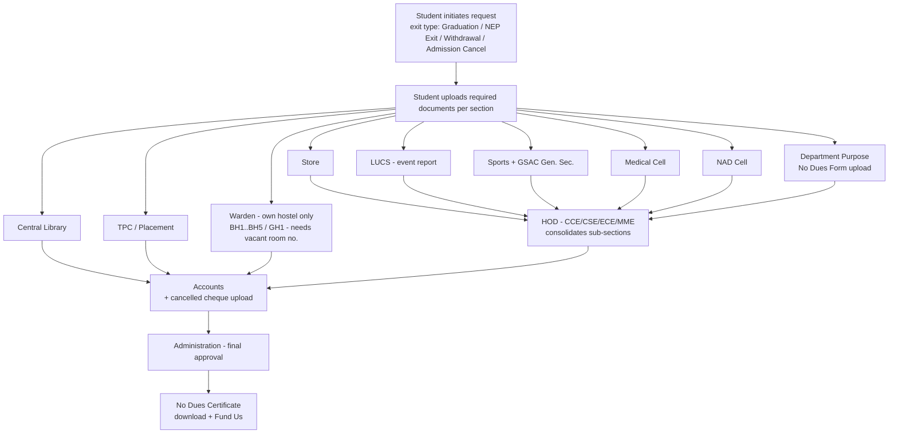

# LNMIIT No Dues Portal — Research & Design Rationale

*How other institutes run their No Dues process, what we found across LNMIIT's own sections, and the reasoning behind our design and technology choices.*

**Project:** LNMIIT No Dues Portal
**Prepared for:** Faculty mentor / co-founder review
**Date:** July 2026

---

## 1. Research: How Other Colleges Run No Dues

We studied official institute portals/forms, publicly written student accounts, and open-source implementations to learn how mature No Dues systems are structured before designing ours. Each source below is an official institute page/PDF, a publicly published account, official framework documentation, or a public code repository. All findings are paraphrased; links are given for verification.

### 1.1 IIT Kanpur — Online No Dues via DOAA / OARS

IIT Kanpur runs graduating-student clearance online through the Dean of Academic Affairs (DOAA) office. A student applies online a few days before thesis submission, then clears specific sections (for example, surrendering the health booklet and ID card at the ID Cell) so those sections turn "cleared" on the portal.

- Clearance is **multi-departmental**: academic records, library, hostel, finance/accounts, laboratories, IT, sports/medical, and placement all sign off. ([multi-department clearance overview, Quora](https://www.quora.com/What-is-the-procedure-to-take-no-dues-from-IIT-K-for-graduating-students))
- A published student account describes the online flow, including how placement (SPO) status must be settled first. ([Online No Dues@IITK, Medium](https://medium.com/@dsoumyadeep97/online-no-dues-iitk-v1-0-bd4be1dd3691))
- Library clearance is tied to **thesis submission to the repository** before No Dues is issued — a conditional, program-specific rule. ([thesis + No Dues account](http://pranjals16.blogspot.com/))
- Official DOAA entry point: `www.iitk.ac.in/doaa`.

**Pattern worth reusing:** a **per-section status model** where each section clears independently, plus **conditional rules** that depend on student type. *Content paraphrased for licensing compliance.*

### 1.2 NITK Surathkal — IRIS No Dues Module

NITK's **IRIS** is a long-running, student-built university management portal (10+ years in production, 24k+ users, 55+ digitized processes on their own about page). No Dues is one of its modules, on web and mobile.

- Scale and production status. ([about.iris.nitk.ac.in](https://about.iris.nitk.ac.in/))
- Student-managed portal ensuring administrative, academic, and alumni procedures happen methodically. ([blog.iris.nitk.ac.in](https://blog.iris.nitk.ac.in/))

**Patterns worth reusing:** **auto-approval** (a student with no dues in a section is cleared automatically) and **section comments** (a section that blocks a student leaves a written reason the student can read and act on).

### 1.3 IIT Guwahati — Django No Dues Form (open source)

A publicly available project automates the IIT Guwahati No Dues form using the **Django framework**, explicitly enforcing the correct hierarchy and clearance order.

- ([vaibz9697/No-Dues-Form, GitHub](https://github.com/vaibz9697/No-Dues-Form))

**Pattern worth reusing:** enforcing clearance **order/hierarchy** as a first-class feature — and confirmation that Django is a proven stack for this exact problem.

### 1.4 Other reference systems

- **IIT Roorkee (undergraduate exit):** return hostel keys + clearance form, library returns and fine clearance, then department/accounts — a clean picture of the minimum sections. ([Quora](https://www.quora.com/What-are-the-formalities-to-be-done-before-leaving-IIT-Roorkee-for-a-passing-out-undergraduate-for-eg-No-Dues-Certificate))
- **Generic clearance guides** list library, hostel, thesis/project supervisor, general administration, central store, accounts, and physical education as standard clearing sections — matching LNMIIT's set. ([No Dues clearance guide, Scribd](https://www.scribd.com/document/880918404/Guide-for-No-Dues-Clearance-Form))
- **Open-source No Dues systems** validating the request → section-approval → final-approval pattern: [ranveer18/NoDueManagementSystem](https://github.com/ranveer18/NoDueManagementSystem), [GVishnudhasan/NoDueProject](https://github.com/GVishnudhasan/NoDueProject).
- A No Dues form pattern that offers a **voluntary welfare-fund contribution** from the refundable deposit. ([Scribd](https://fr.scribd.com/doc/94770273/No-Dues-Certificate-Form))

### 1.5 Cross-institution comparison

| Institution | System type | Sections covered | Auto-approval | Written comments | Final certificate |
|---|---|---|---|---|---|
| IIT Kanpur (DOAA/OARS) | Official online | Academic, Library, Hostel, Accounts, Labs, IT, Sports/Medical, Placement | Partial | Yes (remarks) | Auto-generated PDF |
| NITK (IRIS) | Official online + app | Dept., Library, Hostel, Sports, Alumni, Accounts, IT | Yes | Yes (comments) | Yes (via IRIS) |
| IIT Guwahati (OSS, Django) | Open-source portal | Dept./section hierarchy | No | No | Yes |
| IIT Roorkee | Paper + offices | Hostel, Library, Dept., Accounts | No | Verbal | Physical form |
| **LNMIIT (proposed)** | **Fully digital + OCR** | **Library, TPC, LUCS, Store, Medical, NAD, Sports, Warden, Dept., Accounts, Admin** | **Planned** | **Yes (built-in)** | **Downloadable PDF** |

### 1.6 Honest gaps in the research

Most institute portals sit behind authenticated logins, so full screen-by-screen workflows are not publicly documented. Public accounts confirm the *shape* of the process but not every rule. This is expected for sensitive student data, and it is why building a well-documented system for LNMIIT is worthwhile.

---

## 2. LNMIIT Sections — Roles, Requirements, and What We Found

Based on how each LNMIIT section operates and on conversations with the people who run them. The institute has four departments — **CCE, CSE, ECE, MME** — and roll numbers are **alphanumeric** (e.g. `24UCC174` CCE, `24UCS124` CSE, `24UME034` MME), so the system treats roll number as text. A student first selects an **exit type**: **Graduation, NEP Exit, Withdrawal, or Admission Cancel**, which can change the rules that apply.

| Section | What they do | Needs from student | Upload | What we found |
|---|---|---|---|---|
| **Central Library** | Confirm books returned, fines cleared; thesis/report submission for research students | Name, roll, submission proof | Yes | Genuine dependency (books/fines/thesis); staff want to *see* the document, not re-key it — strong OCR case |
| **TPC (Placement)** | Confirm no placement-related obligation | Name, roll, placement doc | Yes | Only relevant for students who went through placement — good auto-approval case |
| **LUCS** | Confirm event/club/equipment dues settled | **Event report (link or file)** | Yes | Document-driven; "attach a link or a file" must be first-class |
| **Store** | Confirm no outstanding store material | Name, roll | — | Simple lookup; light, fast-clearing; verified later by HOD |
| **Medical Cell** | Confirm no medical-cell dues | Name, roll | — | |
| **NAD Cell** | Confirm records / National Academic Depository formalities | Name, NAD ID, roll | — | |
| **Sports** | Confirm sports equipment returned, no dues | Name, roll | — | Runs **in coordination with the GSAC General Secretary, Sports Council** — the sign-off is shared, not one individual's |
| **Warden (BH1–BH5, GH1)** | Confirm room vacated, no hostel dues; approve/reject | Hostel, **vacant room number** | — | Submission must route to the **student's own hostel warden only**; wardens verify and approve/reject **with a comment** |
| **HOD (per dept.)** | Consolidating checkpoint over Store, LUCS, Sports, Medical, NAD, and Department-Purpose | **Dept. "No Dues Form" (name, roll)** | Yes (form) | HOD relies on sub-sections being clear + confirms the dept. form — maps cleanly to a hierarchy rule |
| **Accounts** | Confirm no financial dues; process refund | Bank details + **cancelled cheque** | Yes | Cancelled-cheque upload belongs here, where bank verification actually happens |
| **Administration** | Final authority; sees all-clear and gives final approval | — | — | Needs a single trustworthy "all-green" view before signing off |

---

## 3. Proposed Clearance Workflow

The order follows the institute's official **"Order of No Dues."** The student initiates a request and uploads proof to each section; independent sections review in parallel; the HOD consolidates a group of sections; Accounts handles refund; Administration gives final approval.

---

## 4. Why We Chose This Design and This Language

This section explains the reasoning behind each major decision. We justify only the choices that genuinely need it.

### 4.1 Why a per-section status matrix (not a single linear form)

Every mature system we studied — IIT Kanpur's DOAA and NITK's IRIS — models clearance as **each section clearing independently**, with the student seeing a unified dashboard. We adopt the same because it lets sections work in parallel (a student isn't blocked at the library while the hostel could already clear them) and gives everyone a single real-time view of exactly where a student stands. This is a proven, production-verified pattern, not an invention.

### 4.2 Why role-based hierarchy + reverse-hierarchy cascade

The clearance genuinely *is* hierarchical: the HOD consolidates Store/LUCS/Sports/Medical/NAD/Department, and Administration only acts once everything is green. Enforcing this in software (HOD unlocks only after its sub-sections clear) mirrors the IIT Guwahati Django implementation. The **reverse cascade** — if a section that had cleared a student later reverts to "due," every downstream approval that depended on it resets to pending — exists so a student can never slip through on a stale approval. Correctness of the final certificate depends on this.

### 4.3 Why approve/reject with written reasons + two-way feedback

NITK's IRIS shows that written **comments** on a block are what actually move the process forward — the student sees *why* and fixes it. We make every rejection carry a reason and add a two-way comment thread on both the student and section portals, so clarification and re-submission happen inside the system instead of over email or in person.

### 4.4 Why hostel-scoped routing

A warden should only ever see students of their own hostel (BH1 submissions go to the BH1 warden only). This is both a privacy requirement and an operational one — it keeps each warden's queue clean and prevents cross-hostel action. So hostel is a routing attribute in the design, not just a display field.

### 4.5 Why Python + Django

Django fits *this* problem — a hierarchical, form-and-document-driven workflow handling sensitive student data — for reasons specific to that shape:

- **Security by default for sensitive data.** Dues, refund bank details, and uploaded IDs are sensitive. Django ships with built-in protection against CSRF, XSS, and SQL injection, so we don't hand-roll security primitives. ([Django security docs](https://docs.djangoproject.com/en/stable/topics/security/); [Django XSS escaping, MDN](https://developer.mozilla.org/en-US/docs/learn/Server-side/Django/web_application_security))
- **A free admin panel for staff.** Django's auto-generated admin lets staff manage students, sections, and records with almost no extra code — valuable for a small team.
- **Proven for exactly this use case.** An open-source IIT Guwahati No Dues portal is already built on Django with hierarchy enforcement. ([vaibz9697/No-Dues-Form](https://github.com/vaibz9697/No-Dues-Form))
- **One language end-to-end.** The OCR requirement (below) is easiest in Python, so the whole stack stays in one language.

We do **not** claim Django is superior in every dimension — the justification is scoped to security, the admin panel, ecosystem fit, and OCR integration, which are the factors that matter here.

### 4.6 Why OCR (and why we still keep downloads)

Section officers should not have to manually open and read every uploaded file to pull out a name/roll number. On upload, the portal runs **OCR** to extract text and validate it against what the student entered; the officer sees the extracted fields **and** a button to download the original.

- We propose **Tesseract** via the **pytesseract** Python wrapper — the most widely used open-source OCR engine, free, and callable in a few lines. ([pytesseract, GitHub](https://github.com/h/pytesseract); [Tesseract background, Unstract](https://unstract.com/blog/guide-to-optical-character-recognition-with-tesseract-ocr/))
- OCR accuracy depends on image quality, so the original file is always kept as the source of truth and remains downloadable. ([OCR accuracy factors, LlamaIndex](https://www.llamaindex.ai/glossary/tesseract-ocr-python))

### 4.7 Why a 50 KB upload cap (with quality guidance)

Uploads are capped at **50 KB per file** to keep storage small and pages fast. Because OCR needs legible text, students are guided to upload the **highest quality that still fits under 50 KB** (compress a clear scan rather than shrink it to unreadable), and files too degraded for reliable recognition are rejected.

### 4.8 Design decisions at a glance

| Decision | Reason | Backed by |
|---|---|---|
| Per-section status matrix | Parallel work + single real-time view | IIT Kanpur DOAA, NITK IRIS |
| Role hierarchy + reverse cascade | Correct, tamper-safe final certificate | IIT Guwahati (Django) |
| Reject with reason + two-way comments | Moves the process forward, in-system | NITK IRIS comments |
| Auto-approval when nothing pending | Removes manual overhead for light sections | NITK IRIS |
| Hostel-scoped warden routing | Privacy + clean queues | LNMIIT warden requirement |
| Python + Django | Built-in security, free admin, proven fit, OCR in Python | Django docs; IIT Guwahati OSS |
| OCR + keep original download | Fast verification without manual reading | pytesseract / Tesseract |
| 50 KB cap + quality guidance | Small storage, fast pages, still OCR-legible | — |

---

## 5. References

All links are official institute pages/PDFs, publicly published accounts, official framework documentation, or public code repositories. Content throughout has been paraphrased and summarised for licensing compliance.

**Institute No Dues processes**
- IIT Kanpur DOAA: https://www.iitk.ac.in/doaa
- Online No Dues @ IITK (student account): https://medium.com/@dsoumyadeep97/online-no-dues-iitk-v1-0-bd4be1dd3691
- IITK multi-department clearance (Q&A): https://www.quora.com/What-is-the-procedure-to-take-no-dues-from-IIT-K-for-graduating-students
- IITK thesis submission + No Dues: http://pranjals16.blogspot.com/
- NITK IRIS (about / scale): https://about.iris.nitk.ac.in/
- NITK IRIS team blog: https://blog.iris.nitk.ac.in/
- IIT Roorkee exit formalities (Q&A): https://www.quora.com/What-are-the-formalities-to-be-done-before-leaving-IIT-Roorkee-for-a-passing-out-undergraduate-for-eg-No-Dues-Certificate
- Generic No Dues clearance guide: https://www.scribd.com/document/880918404/Guide-for-No-Dues-Clearance-Form
- No Dues form with welfare-fund contribution: https://fr.scribd.com/doc/94770273/No-Dues-Certificate-Form

**Open-source No Dues implementations**
- IIT Guwahati No Dues (Django): https://github.com/vaibz9697/No-Dues-Form
- ranveer18/NoDueManagementSystem: https://github.com/ranveer18/NoDueManagementSystem
- GVishnudhasan/NoDueProject: https://github.com/GVishnudhasan/NoDueProject

**Technology**
- Django security overview: https://docs.djangoproject.com/en/stable/topics/security/
- Django web application security (MDN): https://developer.mozilla.org/en-US/docs/learn/Server-side/Django/web_application_security
- pytesseract (Python Tesseract OCR wrapper): https://github.com/h/pytesseract
- Tesseract OCR background: https://unstract.com/blog/guide-to-optical-character-recognition-with-tesseract-ocr/
- OCR accuracy factors: https://www.llamaindex.ai/glossary/tesseract-ocr-python

**LNMIIT**
- LNMIIT official site: https://lnmiit.ac.in/
- LNMIIT Training & Placement Cell: https://placements.lnmiit.ac.in/

---

*Note: The institute's internal "Order of No Dues" circular and the department-purpose "No Dues Form" are the authoritative sources for the exact clearance order and required fields; the workflow in §3 follows them. Items marked "planned" or "proposed" are design recommendations for this project.*
