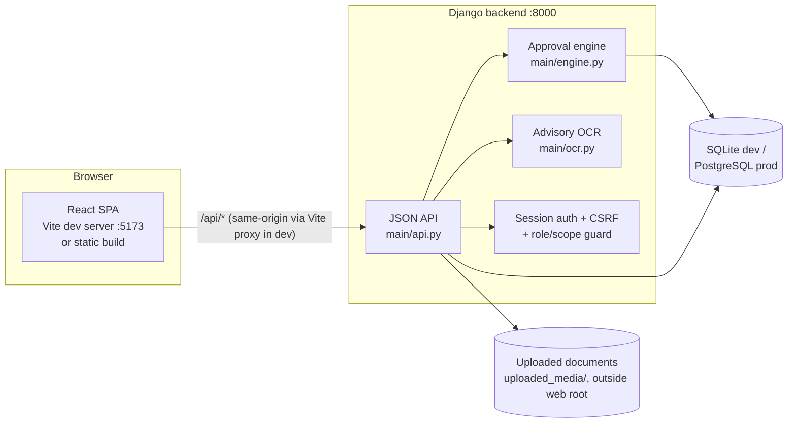

# LNMIIT No-Dues Portal

A web application that digitizes LNMIIT's student clearance ("No Dues") process: a student initiates an exit request, every institutional section (Library, Warden, HOD, Accounts, Administration, …) independently approves or rejects with a mandatory reason, and the student downloads a final No-Dues certificate once every section is green.

- **Frontend:** React 18 + TypeScript + Vite (`frontend/`)
- **Backend:** Django (`No-Dues-Portal/`), session auth, JSON API
- **Database:** SQLite (dev) — see [docs/SCALING.md](./docs/SCALING.md) for the production path

> **New here?** Read this file top to bottom, then go to [`docs/`](./docs) for the deep-dive (architecture, API reference, data model, and the production/scaling plan).

---

## Table of contents

1. [Current status — what's actually built](#current-status--whats-actually-built)
2. [Architecture](#architecture)
3. [Repository layout](#repository-layout)
4. [Quickstart](#quickstart)
5. [Demo logins](#demo-logins)
6. [Documentation map](#documentation-map)
7. [Known gaps](#known-gaps)
8. [Scaling & handling heavy traffic](#scaling--handling-heavy-traffic)

---

## Current status — what's actually built

This section reflects what's actually in the code today, verified directly against `No-Dues-Portal/main/models.py`, `engine.py`, `api.py`, and `frontend/src/` — not an aspirational plan.

| Area | Status | Detail |
|---|---|---|
| React SPA connected to Django over a JSON API | ✅ Done | Session auth + CSRF via a same-origin Vite proxy — see [Architecture](#architecture) |
| LNMIIT data model (`Department`, `Hostel`, `Section`, `ClearanceRequest`, `SectionStatus`, `Document`, `Comment`, `Certificate`) | ✅ Done | `No-Dues-Portal/main/models.py` |
| LNMIIT section set (Library, TPC, Warden, Store, LUCS, Sports, Medical, NAD, Dept-Purpose, HOD, Accounts, Administration) | ✅ Done | `main/management/commands/seed_demo.py` |
| Roll number stored as text (e.g. `24UCC174`) | ✅ Done | `models.py` |
| Exit types (Graduation / NEP Exit / Withdrawal / Admission Cancel) with per-type required sections | ✅ Done | `main/engine.py::REQUIRED_SECTIONS` |
| Prerequisite gating + transactional reverse-hierarchy cascade | ✅ Done | `main/engine.py::approve/reject/_on_status_change` |
| Hostel-scoped Warden queues / department-scoped HOD queues | ✅ Done | `main/api.py::_scope_ok`, `section_queue` |
| Mandatory rejection reason + two-way comment threads | ✅ Done | `engine.reject`, `student_comment`/`officer_comment` |
| Document upload (type/size validated) + access-checked download | ✅ Done | `upload_document`, `document_download` |
| Advisory OCR (roll/name match, never auto-rejects) | ✅ Done, best-effort | `main/ocr.py` — degrades gracefully if Tesseract isn't installed |
| No-Dues certificate | ✅ Done | Generated **client-side as a real PDF** (jsPDF + html2canvas), not server-side — see [Known gaps](#known-gaps) |
| Automated test suite (Hypothesis property tests from `docs/DESIGN.md`) | ❌ Missing | `main/tests.py` is an empty stub |
| Production deployment config (Postgres, gunicorn/nginx, env secrets) | 🟡 Partial | Secrets/DEBUG/hosts are now env-driven (see below); no deployment manifests yet — see [docs/SCALING.md](./docs/SCALING.md) |

## Architecture



**Why same-origin, not CORS:** in development, Vite proxies every `/api/*` request from `localhost:5173` to Django on `127.0.0.1:8000` (`frontend/vite.config.ts`). The browser never sees a cross-origin request, so Django's default session-cookie + CSRF-cookie auth works with no CORS configuration. In production, the two are typically served behind the same reverse-proxy host (nginx) — see [docs/SCALING.md](./docs/SCALING.md).

For the full request lifecycle (login, approval, reverse cascade, certificate) see [docs/ARCHITECTURE.md](./docs/ARCHITECTURE.md). For the section dependency graph and state machine, see [docs/DESIGN.md](./docs/DESIGN.md#approval-engine).

## Repository layout

```
.
├── frontend/                     React + TypeScript + Vite SPA
│   └── src/
│       ├── api.ts                 Typed API client (fetch + CSRF handling)
│       ├── types.ts                Types matching the Django API
│       ├── App.tsx                 Session restore, role-based routing
│       ├── pages/                  LoginPage, StudentDashboard, SectionApprovalPage, ...
│       └── components/Layout.tsx
│
├── No-Dues-Portal/                Django backend
│   ├── myproject/settings.py       Env-driven secret/debug/hosts (see below)
│   └── main/
│       ├── models.py                Data model
│       ├── engine.py                Approval engine: gating + reverse cascade
│       ├── api.py                   JSON API views
│       ├── ocr.py                   Advisory OCR (Tesseract via pytesseract)
│       ├── urls.py
│       └── management/commands/seed_demo.py   Demo data seeding
│
├── docs/                          All deep-dive documentation (the "creator docs")
│   ├── DESIGN.md                    Domain design: section flow, approval engine, correctness properties
│   ├── ARCHITECTURE.md              What's actually running: request lifecycle, sequence diagrams
│   ├── API.md                       Every JSON API endpoint
│   ├── DATA_MODEL.md                ER diagram + field-by-field notes
│   ├── SCALING.md                   Production readiness + load testing plan
│   ├── KNOWN_GAPS.md                Everything found missing/stale, and why
│   ├── loadtest/locustfile.py       Ready-to-run load test
│   └── images/
│
└── LNMIIT_No_Dues_Portal_Research_Document.md   Research behind the section list & design choices
```

## Quickstart

Requires Python 3.10+, Node 18+, and (optionally, for OCR) the Tesseract OCR engine installed at the OS level.

**1. Backend (Django) — Terminal 1**

```bash
cd No-Dues-Portal
python -m venv .venv && .venv\Scripts\activate      # Windows; use `source .venv/bin/activate` on macOS/Linux
pip install -r requirements.txt
python manage.py migrate
python manage.py seed_demo                            # creates demo users/students/sections
python manage.py runserver 8000
```

**2. Frontend (React) — Terminal 2**

```bash
cd frontend
npm install
npm run dev
```

Open **http://localhost:5173**. The Vite dev server proxies `/api/*` to Django on port 8000 — you do not open port 8000 directly except for `/admin`.

**3. Reset demo data at any time**

```bash
python manage.py seed_demo --reset
```

For why no CORS setup is needed (the Vite proxy makes every `/api/*` call same-origin), see [Architecture](#architecture) above or the full request lifecycle in [docs/ARCHITECTURE.md](./docs/ARCHITECTURE.md).

## Demo logins

Password for every account: **`csepassword`**.

| Role | Login (webmail) |
|---|---|
| Student | `student@` · `amit@` (CSE, BH1) · `priya@` (ECE, GH1) · `arjun@` (CCE, BH2) `lnmiit.ac.in` |
| Library / TPC / Store / LUCS / Sports / Medical / NAD | `library@` · `tpc@` · `store@` · `lucs@` · `sports@` · `medical@` · `nad@ lnmiit.ac.in` |
| Department-Purpose (dept form) | `dept.cse@lnmiit.ac.in` |
| HOD (CSE) | `hod.cse@lnmiit.ac.in` |
| Warden (per hostel) | `warden.bh1@` · `warden.gh1@ lnmiit.ac.in` |
| Accounts | `accounts@lnmiit.ac.in` |
| Administration | `admin.office@lnmiit.ac.in` |
| Django admin | `admin` at http://127.0.0.1:8000/admin |

Because of the hierarchy, HOD/Accounts/Administration queues start empty until their prerequisite sections clear — start with Store, Sports, Medical, NAD, or a Warden account to see requests immediately.

## Documentation map

Everything beyond this README lives in [`docs/`](./docs) — one folder, no scattered planning files at the repo root.

| Document | What it's for |
|---|---|
| [`docs/DESIGN.md`](./docs/DESIGN.md) | The domain design: section flow, approval engine, data model rules, correctness properties (P1–P12) |
| [`docs/ARCHITECTURE.md`](./docs/ARCHITECTURE.md) | What's actually running: request lifecycle, sequence diagrams, component responsibilities |
| [`docs/API.md`](./docs/API.md) | Every JSON API endpoint: method, auth, request/response shape |
| [`docs/DATA_MODEL.md`](./docs/DATA_MODEL.md) | ER diagram + field-by-field notes on every model |
| [`docs/SCALING.md`](./docs/SCALING.md) | Production readiness and handling high concurrent traffic (thousands of students) |
| [`docs/KNOWN_GAPS.md`](./docs/KNOWN_GAPS.md) | Everything found to be missing, stale, or inconsistent, and why |
| [`LNMIIT_No_Dues_Portal_Research_Document.md`](./LNMIIT_No_Dues_Portal_Research_Document.md) | Research behind the section list and design choices (kept at root — it's background research, not implementation reference) |

## Known gaps

Full list with detail in [`docs/KNOWN_GAPS.md`](./docs/KNOWN_GAPS.md). Headline items:

- **No automated test suite yet.** `docs/DESIGN.md` specifies 12 correctness properties (prerequisite gating, reverse-cascade consistency, hostel/department scoping, etc.) meant for Hypothesis property-based testing; none are implemented.
- **OCR is best-effort only in dev.** It silently no-ops if Tesseract isn't installed on the machine running Django (by design — OCR is advisory, never blocking — but worth knowing before assuming it's active).
- **No production deployment manifests.** Env-driven config now exists (`DJANGO_SECRET_KEY`, `DJANGO_DEBUG`, `DJANGO_ALLOWED_HOSTS`, `DJANGO_CSRF_TRUSTED_ORIGINS`), but there's no Dockerfile/gunicorn/nginx config committed yet — see [docs/SCALING.md](./docs/SCALING.md) for the recommended path.

## Scaling & handling heavy traffic

You told us this needs to hold up for thousands of students hitting the portal at once (e.g. during an exit-clearance window). The short version — full plan, settings, and a ready-to-run load-test script are in **[docs/SCALING.md](./docs/SCALING.md)**:

- Move from SQLite to PostgreSQL before any real load test (SQLite serializes writes — it will bottleneck under concurrent approvals).
- Run Django under gunicorn (multiple worker processes) behind nginx, not `manage.py runserver`.
- Put a cache (Redis/Memcached) in front of session storage once you're running more than one app server.
- Serve `frontend/dist` and uploaded media through nginx/a CDN, not through Django.
- Add DB indexes on the columns queues filter by (`SectionStatus.status`, `request.is_active`, hostel/department foreign keys) — check with `EXPLAIN` under load.
- Load-test with the included Locust script (`docs/loadtest/locustfile.py`) against a staging environment before the real clearance window, not in production.

---

*Questions or found something else off? Check [docs/KNOWN_GAPS.md](./docs/KNOWN_GAPS.md) first — if it's not listed there, it's new.*
