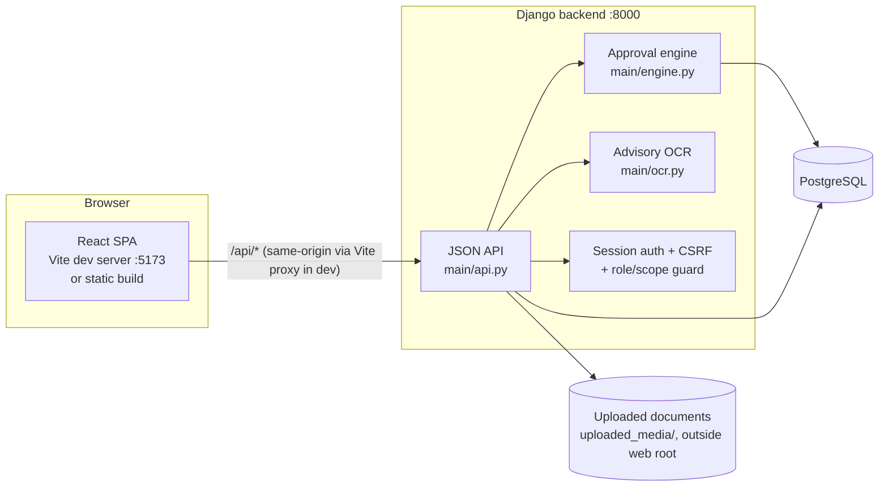

# LNMIIT No-Dues Portal

A web application that digitizes LNMIIT's student clearance ("No Dues") process: a student initiates an exit request, every institutional section (Library, Warden, HOD, Accounts, Administration, …) independently approves or rejects with a mandatory reason, and the student downloads a final No-Dues certificate once every section is green.

- **Frontend:** React 18 + TypeScript + Vite (`frontend/`)
- **Backend:** Django (`No-Dues-Portal/`), session auth, JSON API
- **Database:** PostgreSQL — the only supported database (`docker-compose.yml`, or any `DATABASE_URL`) — see [docs/SCALING.md](./docs/SCALING.md)

> **New here?** Read this file top to bottom, then go to [`docs/`](./docs) for the deep-dive (architecture, API reference, data model, and the production/scaling plan).

---

## Table of contents

1. [Architecture](#architecture)
2. [Repository layout](#repository-layout)
3. [Quickstart](#quickstart)
4. [Docker Compose quickstart (PostgreSQL, production-shaped)](#docker-compose-quickstart-postgresql-production-shaped)
5. [Demo logins](#demo-logins)
6. [Documentation map](#documentation-map)
7. [Scaling & handling heavy traffic](#scaling--handling-heavy-traffic)

---

## Architecture



**Why same-origin, not CORS:** in development, Vite proxies every `/api/*` request from `localhost:5173` to Django on `127.0.0.1:8000` (`frontend/vite.config.ts`). The browser never sees a cross-origin request, so Django's default session-cookie + CSRF-cookie auth works with no CORS configuration. In production, the two are typically served behind the same reverse-proxy host (nginx) — see [docs/SCALING.md](./docs/SCALING.md).

For the full request lifecycle (login, approval, reverse cascade, certificate) see [docs/ARCHITECTURE.md](./docs/ARCHITECTURE.md). For the section dependency graph and state machine, see [docs/DESIGN.md](./docs/DESIGN.md#approval-engine).

## Repository layout

```
.
├── docker-compose.yml             Postgres + gunicorn + nginx stack (see Docker Compose quickstart)
├── .env.example                    Template for docker-compose.yml's environment
│
├── frontend/                      React + TypeScript + Vite SPA
│   ├── Dockerfile                   Multi-stage: npm build -> nginx serve
│   ├── nginx.conf.template           Serves the SPA, proxies /api, /admin, /static to Django
│   │                                 (BACKEND_HOST/BACKEND_PORT/PORT are env-driven — see docs/DEPLOY.md)
│   └── src/
│       ├── api.ts                     Typed API client (fetch + CSRF handling)
│       ├── types.ts                    Types matching the Django API
│       ├── App.tsx                     Session restore, role-based routing
│       ├── pages/                      LoginPage, StudentDashboard, SectionApprovalPage, ...
│       └── components/Layout.tsx
│
├── No-Dues-Portal/                 Django backend
│   ├── Dockerfile                    gunicorn image (installs Tesseract for OCR)
│   ├── docker-entrypoint.sh           Waits for the DB, runs migrations, then execs gunicorn
│   ├── myproject/settings.py          Env-driven secret/debug/hosts/database (see below)
│   └── main/
│       ├── models.py                    Data model
│       ├── engine.py                    Approval engine: gating + reverse cascade
│       ├── api.py                       JSON API views
│       ├── ocr.py                       Advisory OCR (Tesseract via pytesseract)
│       ├── urls.py
│       └── management/commands/seed_demo.py   Demo data seeding
│
├── docs/                           All deep-dive documentation (the "creator docs")
│   ├── DESIGN.md                     Domain design: section flow, approval engine, correctness properties
│   ├── ARCHITECTURE.md               What's actually running: request lifecycle, sequence diagrams
│   ├── API.md                        Every JSON API endpoint
│   ├── DATA_MODEL.md                 ER diagram + field-by-field notes
│   ├── SCALING.md                    Production readiness + load testing plan
│   ├── DEPLOY.md                     Deploying to Railway (+ alternatives) step by step
│   ├── loadtest/locustfile.py        Ready-to-run load test
│   └── images/
│
└── LNMIIT_No_Dues_Portal_Research_Document.md   Research behind the section list & design choices
```

## Quickstart

Requires Python 3.10+, Node 18+, [Docker](https://docs.docker.com/get-docker/) (used here just to run PostgreSQL — see below), and (optionally, for OCR) the Tesseract OCR engine installed at the OS level.

PostgreSQL is the only supported database — there's no SQLite fallback. The quickest way to get one locally without a native install is to start just the `db` service from the bundled `docker-compose.yml`:

```bash
cp .env.example .env    # defaults are fine for local dev — just needs to exist
docker compose up -d db
```

> **Port 5432 already in use?** Some machines already run a local Postgres install on that port (or another Docker project does). Set `POSTGRES_PORT=<something free, e.g. 55432>` in `.env` — `docker compose up -d db` and the steps below both pick it up automatically, nothing else to change.

**1. Backend (Django) — Terminal 1**

```bash
cd No-Dues-Portal
python -m venv .venv && .venv\Scripts\activate      # Windows; use `source .venv/bin/activate` on macOS/Linux
pip install -r requirements.txt
python manage.py migrate
python manage.py seed_demo                            # creates demo users/students/sections
python manage.py runserver 8000
```

No `DATABASE_URL` to export by hand: `myproject/settings.py` loads the repo-root `.env` automatically (`python-dotenv`) and, if `DATABASE_URL` itself isn't set, builds one from `.env`'s `POSTGRES_*` values against `localhost` — the same credentials `docker compose up -d db` above just started listening with. Change `POSTGRES_PASSWORD`/`POSTGRES_PORT` in `.env` and both the container and `manage.py` stay in sync automatically — there's only one place to edit.

**2. Frontend (React) — Terminal 2**

```bash
cd frontend
npm install
npm run dev
```

Open **http://localhost:5173**. The Vite dev server proxies `/api/*` to Django on port 8000 — you do not open port 8000 directly except for `/admin`.

**3. Reset demo data at any time**

```bash
python manage.py seed_demo --reset
```

For why no CORS setup is needed (the Vite proxy makes every `/api/*` call same-origin), see [Architecture](#architecture) above or the full request lifecycle in [docs/ARCHITECTURE.md](./docs/ARCHITECTURE.md).

## Docker Compose quickstart (PostgreSQL, production-shaped)

The setup above still runs Django and Vite directly on your machine (just Postgres in a container). For anything closer to production — or to avoid running Python/Node locally at all — `docker-compose.yml` at the repo root runs the *whole* stack: PostgreSQL, Django under gunicorn, and the built React SPA served by nginx (which also proxies `/api`, `/admin`, and `/static` to Django, the same same-origin trick the Vite dev proxy does).

```bash
cp .env.example .env
# edit .env: set a real DJANGO_SECRET_KEY and POSTGRES_PASSWORD (comments in the file explain each value)

docker compose up --build

# first run only — creates demo users/students/sections against the Postgres DB
docker compose exec backend python manage.py seed_demo
```

Open **`http://localhost`** (or whatever `HTTP_PORT` you set in `.env`). Django admin is at `http://localhost/admin`.

This is also the setup to point [`docs/loadtest/locustfile.py`](./docs/loadtest/locustfile.py) at before trusting the portal with a real clearance window — see [Scaling & handling heavy traffic](#scaling--handling-heavy-traffic) below and [docs/SCALING.md](./docs/SCALING.md) for the full picture (what gunicorn/nginx/Postgres buys you, and what's still not included — e.g. TLS termination, a real domain, CI/CD).

**Verified working end to end** (not just written): all three containers build and start healthy, `/`, `/api/csrf/`, and `/admin/` all respond correctly through nginx, and a full login (`POST /api/login/` with CSRF) succeeds against the containerized Postgres.

**Ready to put this somewhere reachable?** `frontend/nginx.conf.template` and both Dockerfiles are already parameterized for that — `BACKEND_HOST`/`BACKEND_PORT` (where nginx finds Django) and `PORT` (what port nginx itself listens on, matching whatever a given platform injects) are all environment-driven, not hardcoded. **[docs/DEPLOY.md](./docs/DEPLOY.md)** walks through deploying this exact setup to Railway step by step (managed Postgres + a private backend + a public frontend, over Railway's private networking — no CORS needed, same as here), plus notes for Render/Fly.io/a plain VPS, and how to load-test a real deployment without surprising your hosting bill or the students actually using it.

## Demo logins

Password for every account: **`csepassword`**.

| Role | Login (webmail) |
|---|---|
| Student | `student@` · `amit@` (CSE, BH1) · `priya@` (ECE, GH1) · `arjun@` (CCE, BH2) `lnmiit.ac.in` |
| Library / TPC / Store / LUCS / Sports / Medical / NAD | `library@` · `tpc@` · `store@` · `lucs@` · `sports@` · `medical@` · `nad@ lnmiit.ac.in` |
| HOD (CSE) | `hod.cse@lnmiit.ac.in` |
| Warden (per hostel) | `warden.bh1@` · `warden.gh1@ lnmiit.ac.in` |
| Accounts | `accounts@lnmiit.ac.in` |
| Administration | `admin.office@lnmiit.ac.in` |
| Django admin | `admin` at http://127.0.0.1:8000/admin |

Because of the hierarchy, Accounts/Administration queues start empty until their prerequisite sections clear — start with Store, Sports, Medical, NAD, HOD, or a Warden account to see requests immediately (HOD is independent, not gated on the other four).

## Documentation map

Everything beyond this README lives in [`docs/`](./docs) — one folder, no scattered planning files at the repo root.

| Document | What it's for |
|---|---|
| [`docs/DESIGN.md`](./docs/DESIGN.md) | The domain design: section flow, approval engine, data model rules, correctness properties (P1–P12) |
| [`docs/ARCHITECTURE.md`](./docs/ARCHITECTURE.md) | What's actually running: request lifecycle, sequence diagrams, component responsibilities |
| [`docs/API.md`](./docs/API.md) | Every JSON API endpoint: method, auth, request/response shape |
| [`docs/DATA_MODEL.md`](./docs/DATA_MODEL.md) | ER diagram + field-by-field notes on every model |
| [`docs/SCALING.md`](./docs/SCALING.md) | Production readiness and handling high concurrent traffic (thousands of students) |
| [`docs/DEPLOY.md`](./docs/DEPLOY.md) | Deploying to Railway step by step (+ Render/Fly.io/VPS notes), and load-testing a real deployment safely |
| [`LNMIIT_No_Dues_Portal_Research_Document.md`](./LNMIIT_No_Dues_Portal_Research_Document.md) | Research behind the section list and design choices (kept at root — it's background research, not implementation reference) |

## Scaling & handling heavy traffic

The traffic pattern this has to survive is near-idle for most of the semester, then thousands of students logging in and refreshing their status inside the same few-day window before an exit deadline, with dozens of section officers polling their queues throughout. **[docs/SCALING.md](./docs/SCALING.md)** sets out the full plan and rationale; the essentials are below.

PostgreSQL is the only supported database — there is no SQLite fallback anywhere in the codebase, so development and production share the same concurrency semantics rather than diverging on the one behaviour that matters here (SQLite's single-writer file lock versus real concurrency control). `docker-compose.yml` provisions Postgres locally; outside Compose, `DATABASE_URL` points the application at any Postgres host and nothing else changes.

The application runs under gunicorn behind nginx, not `manage.py runserver`. `No-Dues-Portal/Dockerfile` starts three gunicorn workers, and nginx (`frontend/Dockerfile` + `nginx.conf`) serves the built SPA while proxying API, admin, and static traffic to them. The frontend bundle keeps jsPDF and html2canvas lazy-loaded, so the initial download stays around 210 KB.

Two items are deliberately still open. Database indexes on the columns officer queues filter by — `SectionStatus.status`, `request.is_active`, and the hostel and department foreign keys — have not been added yet; confirm the query plans with `EXPLAIN` under load and add them before a real rollout. Session storage is Django's DB-backed default, which is adequate for a single `backend` replica but should move behind a cache such as Redis or Memcached before scaling out with `docker compose up --scale backend=N`.

Load testing is prepared but not yet exercised: the Locust script at [`docs/loadtest/locustfile.py`](./docs/loadtest/locustfile.py) is ready and the Docker Compose stack is a valid target for it. Running it against a sized-up staging copy is the recommended next step before committing to a live clearance window.

---

*Questions? Start with the deep-dive docs in [`docs/`](./docs).*
