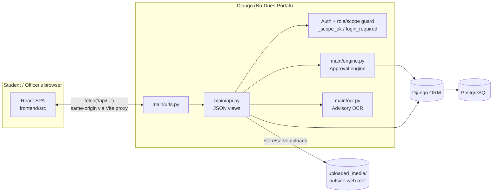
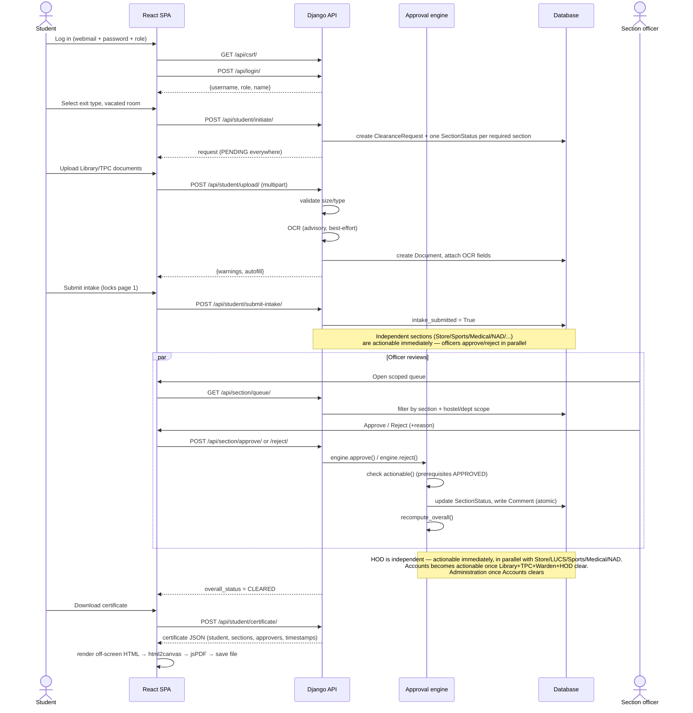
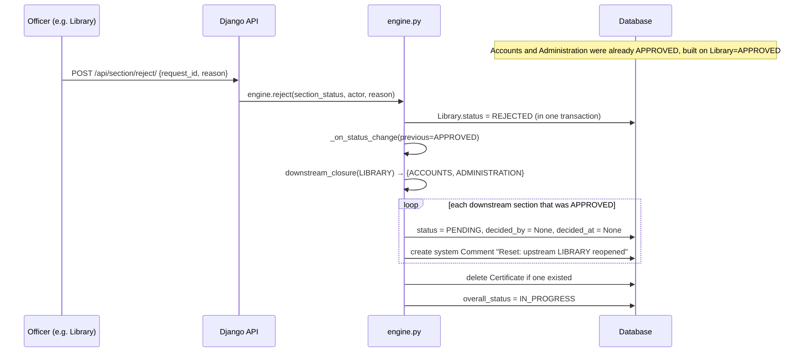

# Architecture

This describes the system as implemented — a decoupled React SPA talking to a Django JSON API — verified against the code (`No-Dues-Portal/main/*.py`, `frontend/src/*`). For the domain rules (why the section order is what it is, the correctness properties), see [`DESIGN.md`](./DESIGN.md).

## System overview

**Session auth, not tokens.** Django's built-in session framework (cookie-based) authenticates every request. The SPA never handles a JWT or bearer token. `GET /api/csrf/` sets the CSRF cookie before any `POST`; `src/api.ts::ensureCsrf()` fetches it automatically the first time a mutating request is made, then attaches it as the `X-CSRFToken` header, matching Django's default `CsrfViewMiddleware` expectations.

**Why the Vite proxy matters.** `frontend/vite.config.ts` proxies `/api/*` to `http://127.0.0.1:8000` in development. Because the browser only ever talks to `localhost:5173`, the session cookie set by Django is same-origin — no CORS headers, no `SameSite=None`, no cross-site cookie complications. In production this same property is achieved by putting both the built SPA and the Django app behind one reverse-proxy host (see [SCALING.md](./SCALING.md)).

## Request lifecycle: student clearance

## Reverse-hierarchy cascade

The one property worth tracing end to end, since it's what makes the final certificate trustworthy:

All of this runs inside a single `transaction.atomic()` block (`engine.py::approve`/`reject`) — the matrix is never left half-updated if the process dies mid-cascade.

## Component responsibilities

| Component | File | Responsibility |
|---|---|---|
| Auth + role/scope guard | `main/api.py::_scope_ok`, `_profile`, `@login_required` | Every state-changing view re-checks role AND hostel/department scope server-side — never trusts client-supplied role claims |
| Approval engine | `main/engine.py` | Owns `PREREQUISITES`, `actionable()`, `approve()`/`reject()`, `downstream_closure()`, `recompute_overall()` |
| OCR service | `main/ocr.py` | Best-effort text extraction; returns `("", {}, [])` if Tesseract/Pillow aren't available — never blocks the upload |
| Upload handling | `main/api.py::upload_document` | Type/size validation (10 MB; JPG/PNG/PDF), stores outside web root (`MEDIA_ROOT`), re-opens rejected sections on re-upload |
| Certificate | `frontend/src/pages/StudentDashboard.tsx::downloadCertificate` | Client-side PDF via jsPDF/html2canvas (lazy-loaded); backend only supplies the JSON payload |
| SPA session bootstrap | `frontend/src/App.tsx` | Calls `GET /api/me/` on load to restore an existing Django session before rendering routes |

## Data flow for documents

Uploaded files never sit under `STATIC_URL`. They're written to `MEDIA_ROOT` (`uploaded_media/`, gitignored) and served only through `GET /api/document/<id>/download/`, which re-checks: is the caller the owning student, the section's officer (in scope), Administration (the only remaining consolidator), or — for Library/TPC specifically — any section officer. Always a forced download (`Content-Disposition: attachment`), not an inline open — inline rendering silently failed (a broken-image placeholder, no error) for anything the browser's content-type guess got wrong. See `main/api.py::document_download`.
