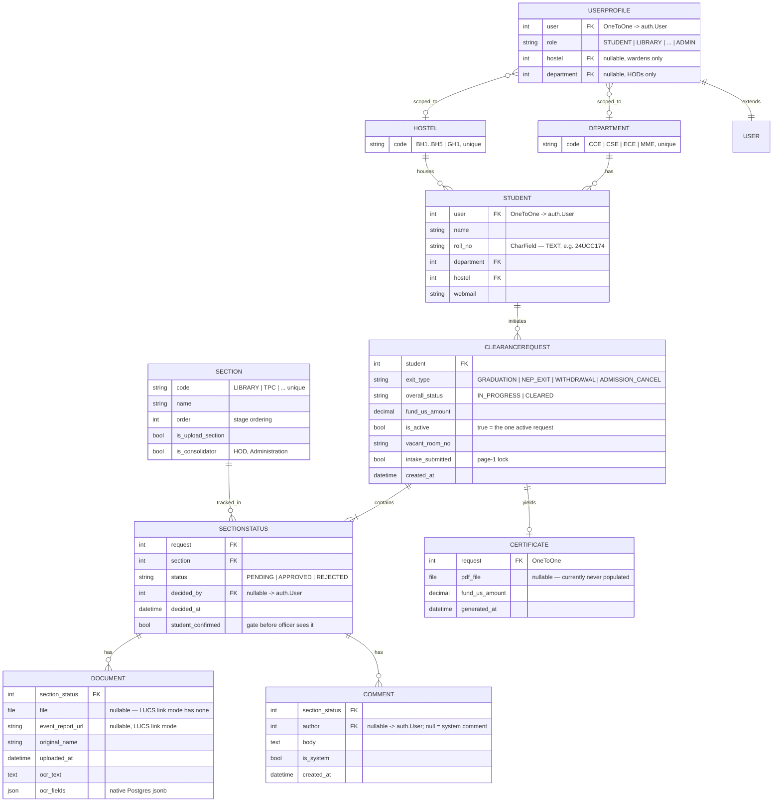

# Data Model

Source: `No-Dues-Portal/main/models.py`. This mirrors [`DESIGN.md`](./DESIGN.md#data-models) closely — differences from that spec are called out below.

## Entity relationship diagram

## Notable implementation details vs. `DESIGN.md`

| DESIGN.md says | Code actually does | Why |
|---|---|---|
| One `ClearanceRequest` per student, full stop | `ClearanceRequest.is_active` flags the current one; `_active_request()` filters on it | Lets history (past exit attempts) stay in the table instead of being deleted |
| — | `ClearanceRequest.intake_submitted` and `SectionStatus.student_confirmed` | Not in `DESIGN.md` — added so "basic" (name/roll-only) sections and the Library/TPC/Warden "tri-gate" only reach an officer's queue after the student explicitly confirms, matching the actual multi-page frontend flow (see `docs/images/ui-wireframe.png`) |
| `Certificate.pdf_file` holds the generated PDF | Never populated — the PDF is generated **client-side** and never uploaded back to the server | Means there's no server-retained copy of an issued certificate |

## Validation invariants (enforced in `engine.py` / `api.py`, not database constraints)

- `roll_no` round-trips as text — never cast to `int` anywhere in the codebase (`DESIGN.md` Property 1).
- `(request, section)` is unique per `SectionStatus` (`Meta.unique_together`).
- A `REJECTED` `SectionStatus` always has an associated `Comment` written in the same request (`engine.reject`).
- `approve()` refuses to run unless every prerequisite section for that section is `APPROVED` (`engine.actionable`).
- Reopening any `APPROVED` section deletes the request's `Certificate` if one exists (`engine._invalidate_certificate`).

None of the above are currently exercised by an automated test suite.
