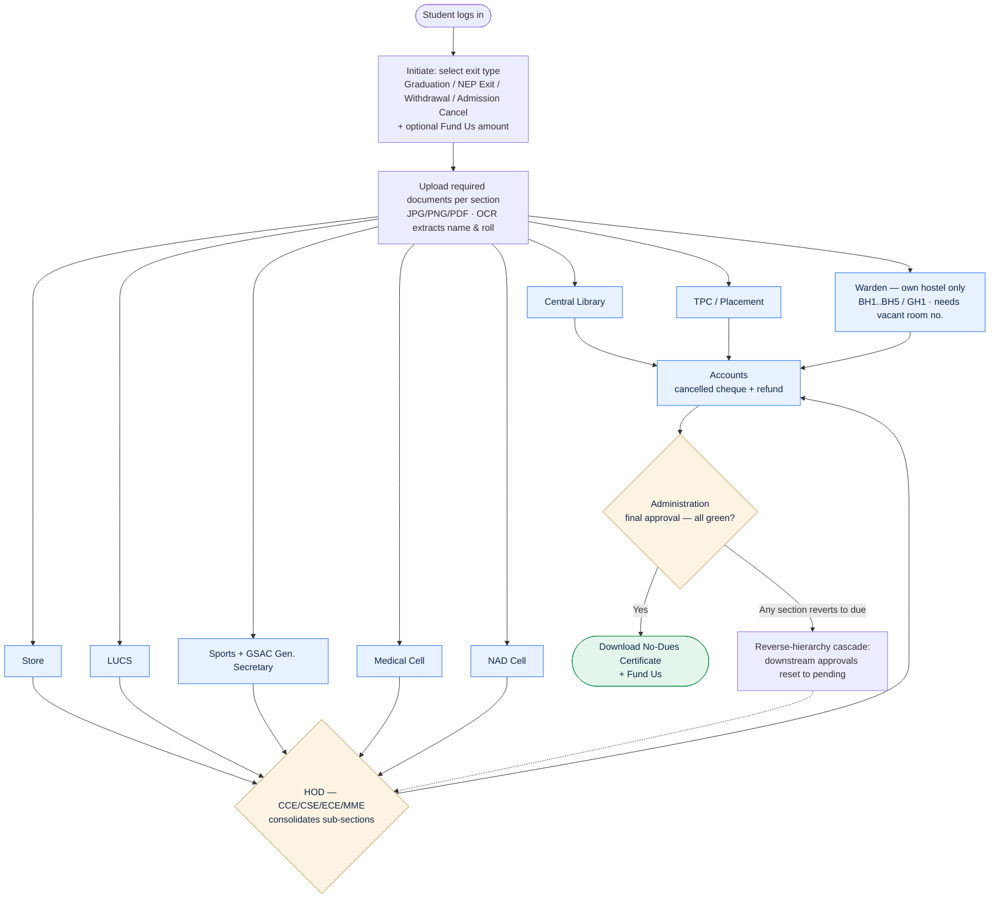
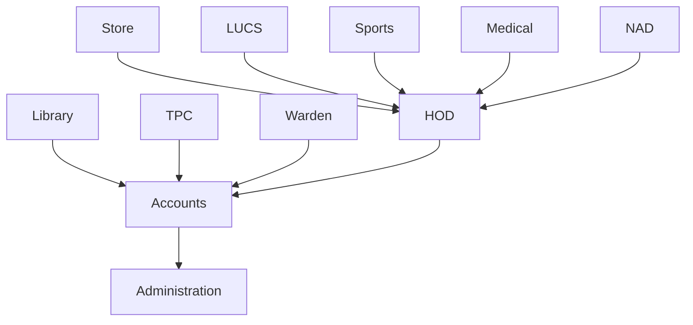
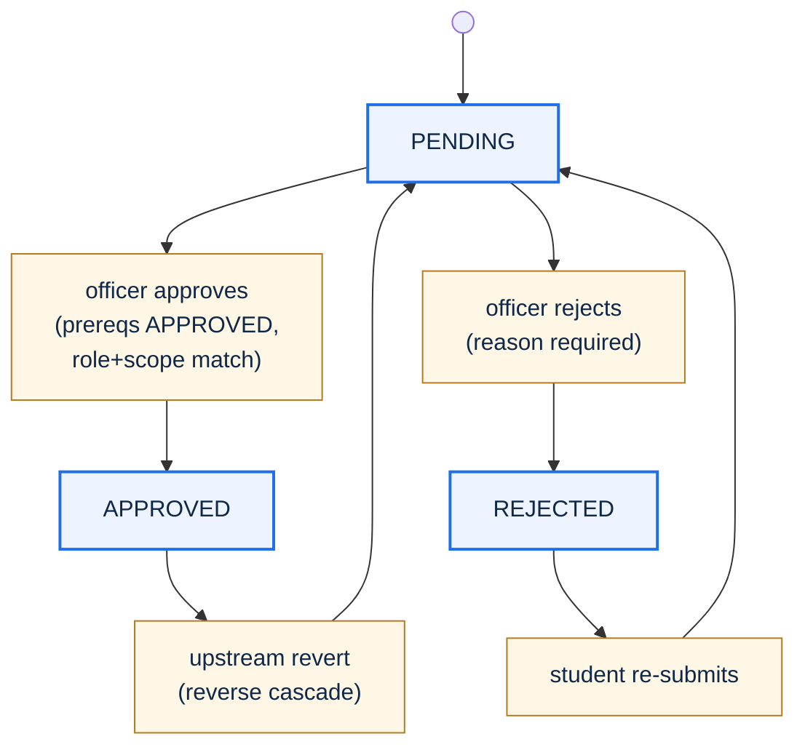
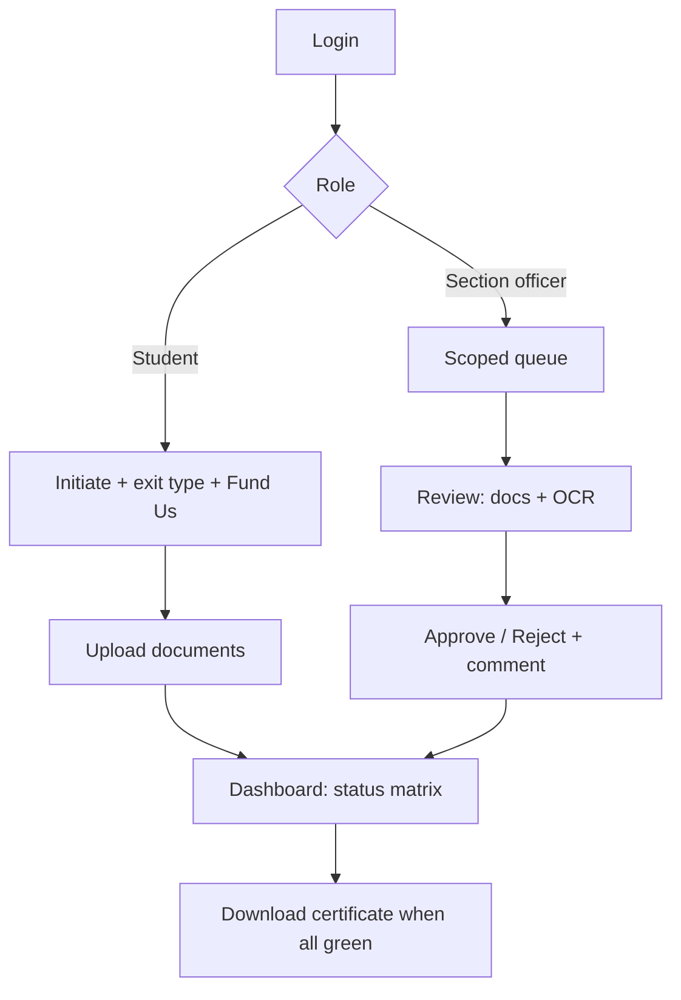

# Domain Design: LNMIIT No Dues Portal

This is the authoritative **domain design** — section flow, approval engine, routing/scoping rules, OCR pipeline, upload handling, certificate rules, and the correctness properties the implementation is expected to satisfy. It was originally written as a coordination document between the developers building this out; now that the build is done, it lives here as the lasting reference for *why the rules are what they are*, folded in alongside the rest of the documentation set.

For **what's actually running** (the React SPA + Django JSON API split, request lifecycle, sequence diagrams), see [`ARCHITECTURE.md`](./ARCHITECTURE.md) — this document predates that implementation and its own architecture description (server-rendered templates) was superseded by the SPA approach. For the concrete model fields and how they differ from what's described here, see [`DATA_MODEL.md`](./DATA_MODEL.md).

## Overview

The LNMIIT No Dues Portal digitizes the institute's student clearance ("No Dues") process end to end. A student initiates a request, selects an exit type, uploads the proof each section requires, and every institutional section independently approves or rejects with a mandatory written reason. Approvals follow a fixed dependency hierarchy; a reverse-hierarchy cascade keeps the final status trustworthy by resetting downstream approvals when an upstream section reopens. Once every required section is cleared, the student downloads a No-Dues certificate.

The system is purpose-built around LNMIIT's own clearance order and section responsibilities — four departments (CCE, CSE, ECE, MME), six hostels (BH1–BH5, GH1), and alphanumeric roll numbers (e.g. `24UCC174`). OCR (via `pytesseract`) is used as an advisory review aid.

**Stack**

- **Language / framework:** Python + Django (JSON API — see [`ARCHITECTURE.md`](./ARCHITECTURE.md) for the actual split with the React frontend), Django admin for staff data management.
- **Database:** PostgreSQL — the only supported database, in every environment (see [`SCALING.md`](./SCALING.md)).
- **OCR:** Tesseract engine via the `pytesseract` wrapper, with Pillow for image preprocessing.
- **Certificate:** generated client-side (jsPDF + html2canvas) — see [`KNOWN_GAPS.md`](./KNOWN_GAPS.md) for why, and what's not yet done about persisting it server-side.
- **Auth:** Django's built-in authentication and session framework; passwords hashed by Django, never stored in plain text.

## Section Flow

The clearance follows the institute's "Order of No Dues." Independent sections review in parallel; the HOD consolidates a group of sections; Accounts handles the refund; Administration gives final approval. Every section supports approve/reject with a mandatory reason and a two-way comment thread (omitted from the diagram for readability).



> **Department-Purpose (a dedicated "HOD form" upload) was removed** as a mandatory gate — HOD no longer requires its own document upload to consolidate. LUCS was also converted from an upload section to a confirm-only one (name/roll, like Store/Sports/Medical/NAD). If an HOD genuinely needs something from a student, they ask for it via the existing section comment thread (`main/api.py::officer_comment` / `student_comment`) rather than a blocking upload requirement — see [`KNOWN_GAPS.md`](./KNOWN_GAPS.md).

## Components and Interfaces

### Component 1: Auth & Role/Scope Guard

**Purpose**: Enforce login on every view and verify role + scope (hostel for wardens, department for HODs) on every state-changing action.

**Responsibilities**:
- Require authentication for all portal views.
- Resolve the acting user's role and scope from their `UserProfile`.
- Reject any action where the officer's role does not match the target section, or the scope does not match the student's hostel/department.
- Re-check authorization server-side on write, independent of any queryset filtering used to build queues.

### Component 2: Approval Engine

**Purpose**: Own the per-section status matrix, enforce dependency prerequisites, and run the reverse-hierarchy cascade.

**Interface**:

```python
class ApprovalEngine:
    def actionable(self, request: ClearanceRequest, section: Section) -> bool:
        """True iff every prerequisite section of `section` is APPROVED."""

    def approve(self, section_status: SectionStatus, actor: User) -> None:
        """Set APPROVED. Requires role+scope match and all prerequisites APPROVED."""

    def reject(self, section_status: SectionStatus, actor: User, reason: str) -> None:
        """Set REJECTED. Requires a non-empty reason; writes decision + Comment atomically."""

    def on_status_change(self, section_status: SectionStatus, previous: str) -> None:
        """If transitioning away from APPROVED, reset the downstream closure to PENDING."""

    def downstream_closure(self, section: Section) -> set[Section]:
        """Transitive set of sections that depend (directly or indirectly) on `section`."""

    def recompute_overall(self, request: ClearanceRequest) -> None:
        """Set overall_status CLEARED iff Administration is APPROVED, else IN_PROGRESS."""
```

**Responsibilities**:
- Guarantee an officer can only approve when prerequisites are satisfied (§ Approval Engine).
- Run the reverse cascade in the same DB transaction as the triggering change so the matrix is never left inconsistent.
- Keep `overall_status` and certificate validity consistent with the matrix.

### Component 3: OCR Service

**Purpose**: Extract text (name, roll number, and section-specific fields) from uploaded files as an advisory aid.

**Interface**:

```python
class OcrService:
    def extract(self, file_path: str) -> OcrResult:
        """Preprocess with Pillow, run pytesseract, parse expected fields."""

    def match_against_student(self, result: OcrResult, student: Student) -> list[str]:
        """Return advisory mismatch warnings (roll/name). Never raises for a mismatch."""
```

**Responsibilities**:
- Run only on eligible uploaded files (JPG/PNG/PDF within size limit).
- Produce extracted text and parsed fields for reviewer display.
- Flag mismatches as warnings only — never auto-reject. The original file remains the source of truth.

### Component 4: Upload Handler

**Purpose**: Validate and store uploads, and serve them only to authorized reviewers.

**Responsibilities**:
- Enforce type (JPG/PNG/PDF) and size limit on both client and server — **10 MB** (`main/api.py::MAX_UPLOAD_BYTES`), matching the original UI design (`docs/images/ui-wireframe.png`); see [`KNOWN_GAPS.md`](./KNOWN_GAPS.md) for how this number was arrived at.
- Store originals outside the web root; serve via an access-checked download view.
- Support link-mode submission (a URL instead of a file) as a generic capability of the upload endpoint; OCR applies only when a file is provided. Not currently used by any section — LUCS was the original use case but was converted to a confirm-only section (no upload at all, see the note under [Section Flow](#section-flow)).
- Always retain the original uploaded file and keep it downloadable by authorized reviewers.

### Component 5: Certificate Generator

**Purpose**: Produce the final No-Dues certificate once the request is cleared.

**Responsibilities**:
- Available only when `overall_status == CLEARED`.
- List student identity, exit type, each section with approver and timestamp, and the Fund-Us contribution.
- Be idempotent; invalidate the certificate if a reverse cascade reopens any section.

## Approval Engine

### Dependency graph

Sections are grouped into stages. A section becomes actionable only when its prerequisites are `APPROVED`.

- **Independent sections** (actionable immediately after submission): Library, TPC, Warden, Store, LUCS, Sports, Medical, NAD.
- **HOD** depends on: Store, LUCS, Sports, Medical, NAD.
- **Accounts** depends on: Library, TPC, Warden, HOD.
- **Administration** depends on: Accounts and, transitively, everything upstream.



### Section-status state machine



### Approval rule

An officer may set a `SectionStatus` to `APPROVED` only if both hold:

1. the officer's role matches the section, and the scope matches (warden's hostel = student's hostel; HOD's department = student's department); and
2. every prerequisite section for that section is `APPROVED`.

A `REJECTED` decision requires a non-empty `Comment`; the reject action and the comment are written in a single transaction.

### Reverse-hierarchy cascade

When a section that was `APPROVED` changes to `REJECTED` or `PENDING`, every section that transitively depends on it is reset to `PENDING`.

```python
def on_status_change(section_status, previous):
    if previous == "APPROVED" and section_status.status != "APPROVED":
        with transaction.atomic():
            for dependent in downstream_closure(section_status.section):
                ds = SectionStatus.objects.get(
                    request=section_status.request, section=dependent
                )
                if ds.status == "APPROVED":
                    ds.status = "PENDING"
                    ds.decided_by = None
                    ds.decided_at = None
                    ds.save()
                    add_system_comment(ds, f"Reset: upstream {section_status.section.code} reopened")
            section_status.request.overall_status = "IN_PROGRESS"
            section_status.request.save()
            invalidate_certificate(section_status.request)  # if one existed
```

`downstream_closure` is computed from the dependency graph. The cascade runs inside the same DB transaction as the triggering change so the matrix is never left inconsistent.

### Final clearance

`overall_status` becomes `CLEARED` only when Administration is `APPROVED` (which, by the dependency graph, guarantees all other required sections are `APPROVED`). Certificate generation is gated on `CLEARED`.

## Routing & Scoping

### Hostel-scoped warden queues

A warden's queue is `SectionStatus` rows where `section = Warden` and `request.student.hostel == warden.hostel`. A BH1 warden can never see or act on a BH2 student's record. Enforced in the queryset **and** re-checked on every write.

### Department-scoped HOD queues

An HOD's queue is filtered by `request.student.department == hod.department`, and further restricted to requests whose HOD-prerequisite sections are all `APPROVED`.

### Officer visibility

Each officer sees only rows for their own section (and scope). Administration sees the global final-stage queue (requests where all other required sections are `APPROVED`). This is a queryset-level filter plus a per-action authorization check.

### Exit-type rules

`exit_type` determines the required section set for a request. Graduation uses the full set; NEP Exit, Withdrawal, and Admission Cancel omit TPC (no placement obligation applies). The required set is resolved once at request creation, and one `SectionStatus` row is created per required section.

## OCR Pipeline

On upload to an upload-enabled section:

```python
def process_upload(uploaded_file, section_status, student):
    # 1. Validate: type in {jpg, png, pdf}, size within limit — else reject.
    validate_upload(uploaded_file)

    # 2. Store original outside web root (always retained).
    path = store_secure(uploaded_file)

    # 3. Preprocess with Pillow (grayscale, light denoise/threshold).
    # 4. Run pytesseract.image_to_string() -> ocr_text.
    # 5. Parse expected fields (name, roll_no, NAD id, ...) -> ocr_fields (JSON).
    result = ocr_service.extract(path)

    # 6. Compare parsed roll_no/name against the student record; flag mismatches (advisory).
    warnings = ocr_service.match_against_student(result, student)

    Document.objects.create(
        section_status=section_status, file=path,
        ocr_text=result.text, ocr_fields=result.fields,
    )
    return warnings  # shown to reviewer; never auto-rejects
```

- The officer UI shows the extracted fields **and** a download link to the original.
- OCR is advisory: a mismatch raises a warning; it does not auto-reject. The original file is the source of truth.
- In practice this degrades to a no-op if Tesseract isn't installed on the machine running Django — see [`KNOWN_GAPS.md`](./KNOWN_GAPS.md).

## Upload Handling

- **Limit:** enforced both client-side (pre-check) and server-side (hard validation). See [`KNOWN_GAPS.md`](./KNOWN_GAPS.md) for the actual configured value.
- **Types:** JPG, PNG, PDF.
- **Quality guidance:** the upload control advises submitting the highest quality that fits the limit; files too degraded for OCR are flagged.
- **Link mode:** the upload endpoint generically also accepts a URL instead of a file (originally used by LUCS; no section currently uses it — see [Section Flow](#section-flow)); OCR applies only when a file is provided.
- **Storage:** files stored outside the web root; served to authorized reviewers through an access-checked download view, not by direct static URL.

## Certificate & Fund Us

- When `overall_status == CLEARED`, a "Download Certificate" action produces a document listing the student, exit type, and every section with its approver and timestamp.
- The **Fund Us** amount captured at initiation is stored on the request; Accounts deducts it from the refund and it appears on the certificate/refund ledger.
- Certificate generation is idempotent and is invalidated if a reverse cascade reopens any section.

## Screen Flow & Routes

| Route | Role | Purpose |
|---|---|---|
| `/login` | all | Role-based login |
| `/student/initiate` | Student | Select exit type, set Fund-Us amount |
| `/student/upload` | Student | Upload per-section documents (Library, TPC, Accounts) |
| `/student/dashboard` | Student | Per-section status matrix, comments, re-upload, certificate |
| `/section/<code>/queue` | Section officer | Scoped queue of pending requests |
| `/section/<code>/review/<id>` | Section officer | View docs + OCR, approve/reject with comment |
| `/hod/queue` | HOD | Department-scoped consolidated queue |
| `/accounts/queue` | Accounts | Refund + cancelled-cheque review |
| `/admin-office/queue` | Administration | Final all-green approval |
| `/certificate/<id>` | Student | Download final certificate |



## Access Control & Security

- Every view is login-required and role-guarded; every state-changing action re-verifies role **and** scope (hostel/department) server-side.
- CSRF protection on all forms (Django default); template auto-escaping for XSS; ORM parameterization against SQL injection.
- Uploaded files are access-checked on download; sensitive fields (bank details, cancelled cheque) are visible only to Accounts and Administration.
- All approval/rejection actions and reverse-cascade resets are recorded with actor and timestamp for an audit trail.

## Correctness Properties

These properties are stated for property-based testing (e.g. Hypothesis). Each should hold for all valid inputs over the domain described. **None of these are currently covered by an automated test** — see [`KNOWN_GAPS.md`](./KNOWN_GAPS.md).

### Property 1: Roll number is always text

For any student, `roll_no` is stored and retrieved as a string and round-trips unchanged, including values with leading digits and embedded letters (e.g. `24UCC174`).

```python
# for all valid roll strings r drawn from the LNMIIT pattern:
assert isinstance(student.roll_no, str)
assert Student.objects.get(pk=student.pk).roll_no == r
```

### Property 2: Prerequisite gating (no out-of-order approval)

For any request and any section `s`, if some prerequisite of `s` is not `APPROVED`, then `approve(s)` is rejected and the status of `s` stays unchanged.

```python
# for all requests, all sections s, all officers with matching role+scope:
if not all(prereq.status == "APPROVED" for prereq in prerequisites(s)):
    with pytest.raises(PermissionError):
        engine.approve(section_status(request, s), officer)
```

### Property 3: Reverse-cascade consistency

After any sequence of approvals/rejections, the matrix satisfies: no section is `APPROVED` while any of its prerequisites is not `APPROVED`.

```python
# invariant that must hold after every operation:
for req in ClearanceRequest.objects.all():
    for ss in req.sectionstatus_set.filter(status="APPROVED"):
        assert all(p.status == "APPROVED" for p in prerequisites(ss.section))
```

### Property 4: Cascade completeness

If an `APPROVED` section transitions away from `APPROVED`, then every section in its transitive downstream closure that was `APPROVED` becomes `PENDING`.

```python
before = {d: status(d) for d in downstream_closure(s)}
engine.reject(section_status(request, s), officer, reason="...")
for d in downstream_closure(s):
    if before[d] == "APPROVED":
        assert status(d) == "PENDING"
```

### Property 5: Hostel scoping

For any warden action, the target request's student hostel equals the warden's hostel; otherwise the action is denied. No warden query ever returns a student from another hostel.

```python
# for all wardens w, all warden-section rows visible to w:
assert row.request.student.hostel == w.profile.hostel
# and a cross-hostel write is always denied:
with pytest.raises(PermissionError):
    engine.approve(other_hostel_row, w)
```

### Property 6: Department scoping

For any HOD action, the target request's student department equals the HOD's department; otherwise the action is denied. No HOD query returns a student from another department.

### Property 7: Rejection requires a reason

Every `REJECTED` `SectionStatus` has at least one non-empty `Comment` authored in the same transaction. A reject call with empty/whitespace reason leaves the status unchanged.

```python
with pytest.raises(ValidationError):
    engine.reject(section_status, officer, reason="   ")
assert section_status.status != "REJECTED"
```

### Property 8: Certificate gating

A certificate exists for a request only if `overall_status == CLEARED`, which holds only if Administration is `APPROVED` and (by P3) all required sections are `APPROVED`.

```python
if Certificate.objects.filter(request=req).exists():
    assert req.overall_status == "CLEARED"
    assert section_status(req, ADMINISTRATION).status == "APPROVED"
    assert all(ss.status == "APPROVED" for ss in required_sections(req))
```

### Property 9: Certificate invalidation on reopen

If a reverse cascade reopens any section on a request that had a certificate, the certificate is invalidated and `overall_status` returns to `IN_PROGRESS`.

### Property 10: OCR is advisory only

For any upload with an OCR name/roll mismatch, the section status is never changed automatically; the original file remains stored and downloadable.

```python
warnings = process_upload(bad_scan, section_status, student)
assert warnings != []                      # mismatch flagged
assert section_status.status == "PENDING"  # never auto-rejected
assert Document.objects.get(section_status=section_status).file  # original retained
```

### Property 11: Upload validation

Any file exceeding the configured size limit or of a disallowed type is rejected and no `Document` is created; any accepted file is exactly one of JPG/PNG/PDF and within the limit.

### Property 12: Single active request

At most one active `ClearanceRequest` exists per student at any time; re-initiation while one is active is blocked.

## Error Handling

### Duplicate active request

**Condition**: Student initiates while an active request exists.
**Response**: Initiation blocked with a clear message.
**Recovery**: Student continues the existing request from the dashboard.

### Out-of-order approval attempt

**Condition**: Officer tries to approve before prerequisites are `APPROVED`.
**Response**: Denied by the prerequisite check; status unchanged.
**Recovery**: Officer acts once upstream sections clear.

### Certificate issued then upstream reopened

**Condition**: An upstream section reverts after a certificate was generated.
**Response**: Reverse cascade resets downstream to `PENDING`, invalidates the certificate, sets `overall_status = IN_PROGRESS`.
**Recovery**: Sections re-approve; certificate regenerates when cleared again.

### Oversized or unreadable upload

**Condition**: File over the size limit, wrong type, or too degraded for OCR.
**Response**: Oversized/wrong-type files rejected at validation with a clear message; degraded-but-valid files accepted with an OCR-quality warning (not an auto-reject).
**Recovery**: Student re-uploads a compliant file.

### Wrong-hostel / wrong-department access

**Condition**: Officer attempts to view or act on an out-of-scope record (even via a guessed URL).
**Response**: Denied by the server-side scope check.
**Recovery**: None needed; action is refused and auditable.

## Testing Strategy

### Unit Testing Approach

- Model validation: `roll_no` as text, enum constraints, `(request, section)` uniqueness, rejection-requires-comment invariant.
- Approval engine: prerequisite gating, approve/reject transitions, `downstream_closure` correctness, `recompute_overall`.
- Upload validation: size/type limits on client and server paths.
- OCR service: field parsing and advisory matching (with fixed sample images).

### Property-Based Testing Approach

Encode the Correctness Properties (P1–P12) as properties over randomized operation sequences and student/section data.

**Property Test Library**: Hypothesis (Python).

Focus areas: hierarchy invariants (P2–P4), scoping (P5–P6), certificate gating/invalidation (P8–P9), roll-number-as-text (P1), and upload validation (P11).

### Integration Testing Approach

- End-to-end clearance for each exit type: initiate → upload → parallel section approvals → HOD consolidation → Accounts → Administration → certificate download.
- Reverse-cascade scenario: clear through Administration, reopen an upstream section, assert downstream reset and certificate invalidation.
- Access-control scenarios: cross-hostel and cross-department attempts via direct URLs; unauthorized document download attempts.

## Security Considerations

- Login required on every view; role + scope re-verified server-side on every state-changing action.
- Django defaults for CSRF, XSS (template auto-escaping), and SQL injection (ORM parameterization).
- Documents stored outside web root and served only through an access-checked download view.
- Sensitive financial data (bank details, cancelled cheque) restricted to Accounts and Administration.
- Full audit trail: actor + timestamp on every decision and every reverse-cascade reset.

## Dependencies

- **Django** — web framework, ORM, auth, admin, CSRF/XSS/SQLi protections.
- **pytesseract** + **Tesseract OCR engine** — advisory text extraction from uploads.
- **Pillow** — image preprocessing for OCR.
- **jsPDF + html2canvas** — client-side certificate PDF generation.
- **Database**: PostgreSQL — the only supported database, in every environment (see [`SCALING.md`](./SCALING.md)).

## Implementation Notes (non-negotiable)

- Store `roll_no` as text, never integer.
- No cross-hostel or cross-department visibility.
- No HOD approval before its prerequisite sections are approved; no Administration approval before all required sections are approved.
- No rejection without a written reason.
- OCR never replaces the original document; originals remain downloadable.
